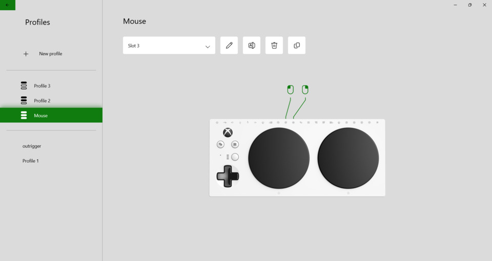
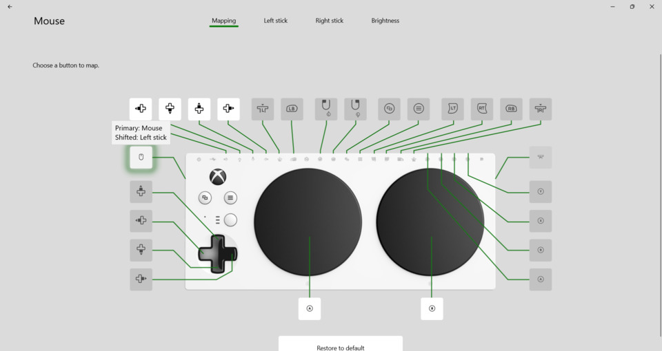
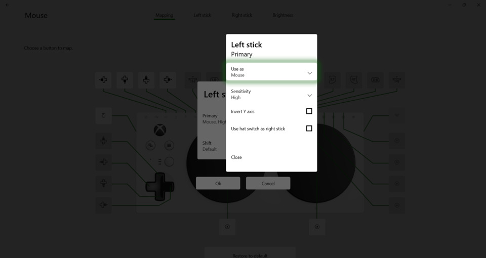
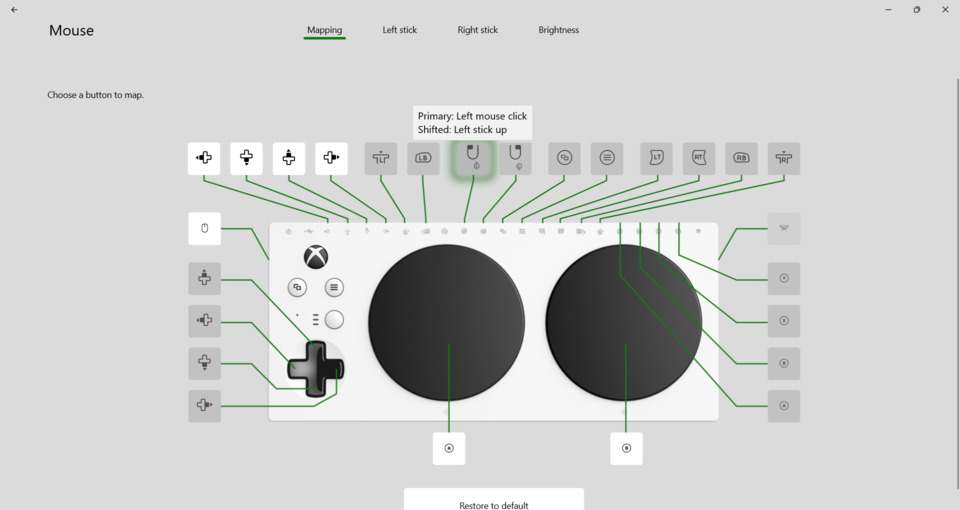
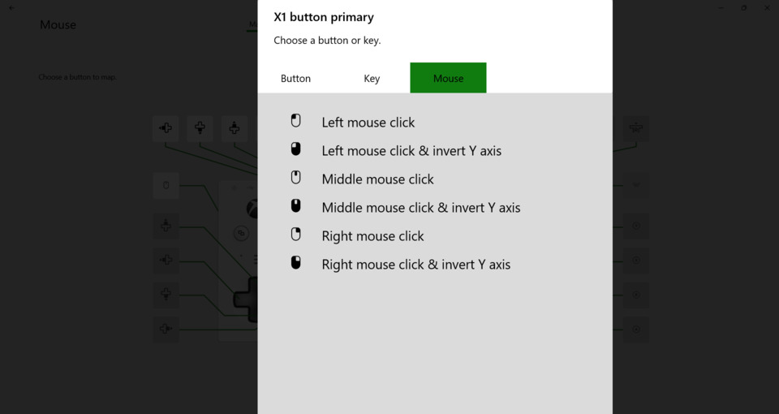
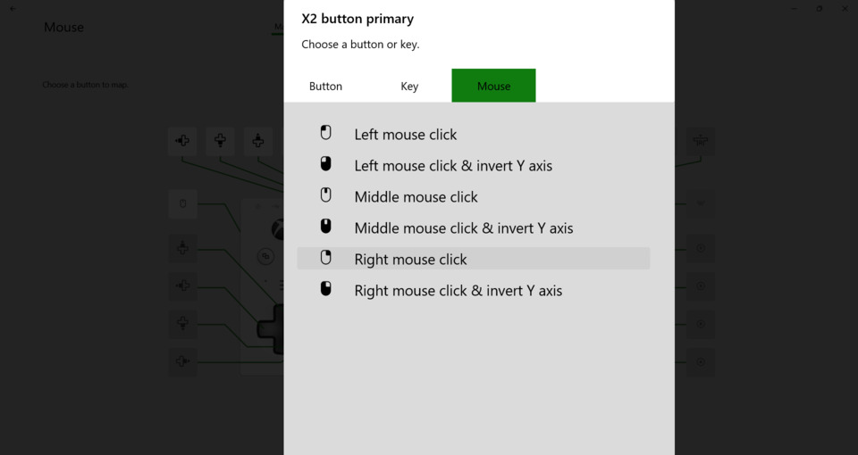

# Configure Xbox Adaptive Controller as Joystick to Mouse Converter

The Xbox Adaptive Controller (XAC) can convert joystick input from a USB
joystick compatible with the XAC to mouse movement output. Joystick buttons can
be configured as mouse left, middle, and right buttons. If the joystick does
not have buttons, it is possible to plug in AT switches into the XAC input
jacks. The switches can be configured as mouse buttons.

Be sure to upgrade the XAC firmware to the latest version. Use the Xbox
Accessories app which is available on Xbox consoles and Windows.

The following shows a mouse profile. When a joystick is plugged into the left
USB port, the first joystick button works as the mouse left click button.  The
second joystick button works as the mouse right click button. In the case of
the Logitech Extreme 3D Pro, the front trigger button is the mouse left click.
The side thumb trigger button is the mouse right click.

When the profile is opened, the left joystick port is highlighted showing it
is configured for mouse output.

More details on changing the left stick port to mouse output.

The following shows the X1/Left stick up input is configured for left mouse
click. Note X1/Left stick up corresponds to the first joystick button. In the
case of the Logitech Extreme 3D Pro, the first button is the front trigger
button. Note: Nothing needs to be plugged into the X1 input jack.

More details on the mouse click options.

The following shows the X2/Left stick down input is configured for right mouse
click. Note X2/Left stick down corresponds to the second joystick button. In
the case of the Logitech Extreme 3D Pro, the second button is the side thumb
trigger button. Note: Nothing needs to be plugged into the X2 input jack.

More details on the mouse click options.

The XAC can also output keyboard key presse. For example, the direction pad can
be configured to send keyboard WASD. This can be used to play Windows games
that does not work with the XAC gamepad.

## References

[Keyboard Button Mapping for Xbox Controllers](https://news.xbox.com/en-us/2023/08/03/keyboard-button-mapping-for-xbox-controllers/)
